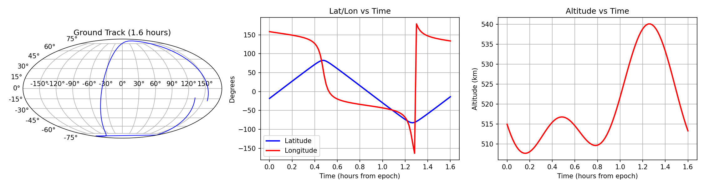

# Tracking a Satellite in LEO with a Ground-Based Tracker

The [satellite_tracking.ipynb](https://github.com/neelaydoshi/Astrodynamics/blob/main/Satellite_Tracking/mission_design-%20satellite%20tracking.ipynb) shows a simple example of tracks a satellite in LEO, given its two-line elements (TLE) data and the location of the ground-based tracker, along with its "field of regard". The [Skyfield](https://github.com/skyfielders/python-skyfield) library is used for the simulation.

  
   
  <b>Figure 1: Satellite ground track and position coordinates. </b>

